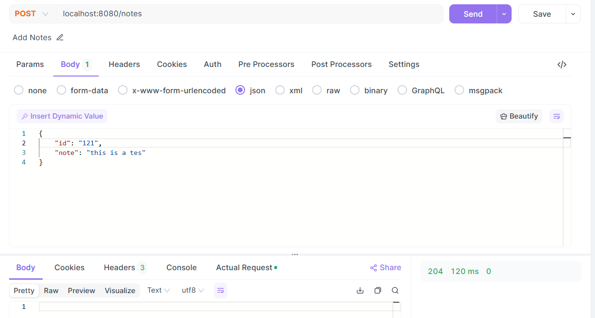

# Spring Boot Application: ota-api

## Table of Contents
1. [Introduction](#introduction)
2. [Features](#features)
3. [Prerequisites](#prerequisites)
4. [Running the Application](#running-the-application)
5. [Usage](#usage)

## Introduction
A simple backend for a note-taking application using either Spring-boot, built with a simple in-memory map.

### API Endpoints:
- POST /notes: Create a new note.
- GET /notes: Retrieve all notes.
- GET /notes/:id: Retrieve a specific note by ID.
- PUT /notes/:id: Update a specific note.
- DELETE /notes/:id: Delete a specific note.

#### Features:
- Data Storage: stored in-memory, using map
- Data Validation: validation of input for creating and updating notes (checking for blank values)
- Error Handling: basic error handling for common scenarios (e.g., note not found).

## Prerequisites
Tools required to run the application:
- Git/GitHub Application
- Java Development Kit (JDK) 17 or higher
- Maven 3.6 or higher
- Eclipse IDE (optional: application can be run via CLI)
- REST Client (e.g. PostMan, ApiDog) or curl (for accessing via CLI)

## Installation
Clone repository to local directory:

```bash

# Clone the repository
git clone https://github.com/klouis-commits/ota-api.git

```

## Running the Application

### Via Eclipse IDE

1. Import/Open project in Eclipse IDE
- Right-click project folder in Project Explorer of Eclipse, then select 'Run As' -> 'Spring Boot App'
<p>
	
</p>
- Application should be running when the following logs are shown in the Console: "Completed initialization..."
<p>
	
</p>
- Application should be running on port 8080; access the served REST APIs by using REST Client Tools (like Postman or Apidog)
<p>
	
</p>

### Via CLI (Maven)

```bash

# Navigate to the project directory
cd <project-directory>

# run application via Maven
mvn spring-boot:run

# successsful run should display the following message in the logs "Started Application..."
...
2024-06-07T23:53:18.324+08:00  INFO 35308 --- [main] o.s.b.w.embedded.tomcat.TomcatWebServer  : Tomcat started on port 8080 (http) with context path '/'
2024-06-07T23:53:18.331+08:00  INFO 35308 --- [main] ph.com.ota.api.Application               : Started Application in 1.647 seconds (process running for 1.909)

# Application should be running on port 8080 and can be accessed by any REST Client
# sample curl
curl --location --request POST "localhost:8080/notes" --header "Content-Type: application/json" --data-raw "{ \"id\": \"11\", \"note\": \"this is a tes\"}" -v
Note: Unnecessary use of -X or --request, POST is already inferred.
*   Trying [::1]:8080...
* Connected to localhost (::1) port 8080
> POST /notes HTTP/1.1
> Host: localhost:8080
> User-Agent: curl/8.4.0
> Accept: */*
> Content-Type: application/json
> Content-Length: 44
>
< HTTP/1.1 204
< Date: Fri, 07 Jun 2024 16:00:57 GMT
<
* Connection #0 to host localhost left intact

```

## Usage
### Creating/Adding Notes
<details>
 <summary><code>POST</code> <code><b>/notes</b></code></summary>

##### Request Headers
> | header       | value            |
> |--------------|------------------|
> | Content-Type | application/json |

##### Request Body (JSON)
> | name      | data type | description                     |
> |-----------|-----------|---------------------------------|
> | id        | number    | Unique identifier for the note  |
> | note      | string    | Contents of the note            |
>
> Sample:
> ```json
> {
>   "id": 1,
>   "note": "string"
> } 
> ```

##### Responses
> | http code     | content-type                      | response                                                            |
> |---------------|-----------------------------------|---------------------------------------------------------------------|
> | `204`         | N/A                               | None (Success response)                                             |
> | `400`         | `text/plain;charset=UTF-8`        | Validation Errors: [...]                                            |
> | `409`         | `text/plain;charset=UTF-8`        | Notes with ID already existing: ...                                 |
</details>

### Get All Notes
<details>
 <summary><code>GET</code> <code><b>/notes</b></code></summary>
  
##### Request Headers
> | header       | value            |
> |--------------|------------------|
> | N/A          | N/A              |

##### Request Body (JSON)
> | name      | data type | description                     |
> |-----------|-----------|---------------------------------|
> | N/A       | N/A       | N/A                             |

##### Responses
> | http code     | content-type                      | response                                                            |
> |---------------|-----------------------------------|---------------------------------------------------------------------|
> | `200`         | `application/json`                | Array of notes with  their corresponding id and content             |
>
> Sample:
> ```json
> [
>   {
>     "id": 121,
>     "note": "this is a tes"
>   },
>   {
>     "id": 11,
>     "note": "this is a tes"
>   }
> ]
> ```
</details>

### Get Specific Note by ID
<details>
 <summary><code>GET</code> <code><b>/notes/{id}</b></code></summary>
  
##### Path Parameters
> | name       | description                     |
> |------------|---------------------------------|
> | id         | Unique identifier for the note  |

##### Request Headers
> | header       | value            |
> |--------------|------------------|
> | N/A          | N/A              |

##### Request Body (JSON)
> | name      | data type | description                     |
> |-----------|-----------|---------------------------------|
> | N/A       | N/A       | N/A                             |

##### Responses
> | http code     | content-type                      | response                                                            |
> |---------------|-----------------------------------|---------------------------------------------------------------------|
> | `200`         | `application/json`                | Specific note with  their corresponding id and content              |
>
> Sample:
> ```json
> {
>   "id": 11,
>   "note": "this is a tes"
> }
> ```
</details>

### Update a specific note
<details>
 <summary><code>PUT</code> <code><b>/notes/{id}</b></code></summary>
  
##### Path Parameters
> | name       | description                     |
> |------------|---------------------------------|
> | id         | Unique identifier for the note  |

##### Request Headers
> | header       | value            |
> |--------------|------------------|
> | Content-Type | application/json |

##### Request Body (JSON)
> | name      | data type | description                     |
> |-----------|-----------|---------------------------------|
> | note      | string    | Updated contents of the note    |

##### Responses
> | http code     | content-type                      | response                                                            |
> |---------------|-----------------------------------|---------------------------------------------------------------------|
> | `204`         | N/A                               | None (Success response)                                             |
> | `400`         | `text/plain;charset=UTF-8`        | Validation Errors: [...]                                            |
> | `404`         | `text/plain;charset=UTF-8`        | Could not find note with ID: ...                                    |
</details>

### Delete a specific note
<details>
 <summary><code>DELETE</code> <code><b>/notes/{id}</b></code></summary>
  
##### Path Parameters
> | name       | description                     |
> |------------|---------------------------------|
> | id         | Unique identifier for the note  |

##### Request Headers
> | header       | value            |
> |--------------|------------------|
> | N/A          | N/A              |

##### Request Body (JSON)
> | name      | data type | description                     |
> |-----------|-----------|---------------------------------|
> | N/A       | N/A       | N/A                             |

##### Responses
> | http code     | content-type                      | response                                                            |
> |---------------|-----------------------------------|---------------------------------------------------------------------|
> | `204`         | N/A                               | None (Success response)                                             |
> | `404`         | `text/plain;charset=UTF-8`        | Could not find note with ID: ...                                    |
</details>
